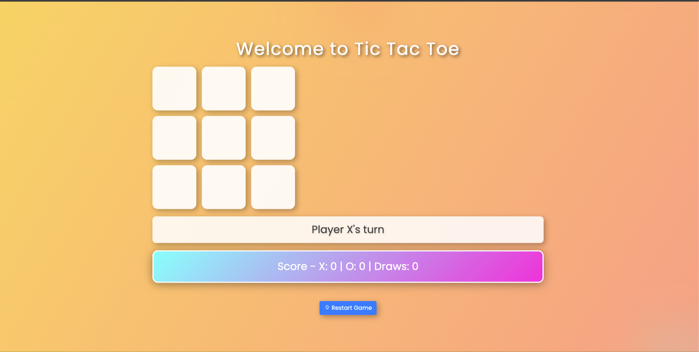

## Here is a complete `README.md` file for your Tic Tac Toe project, including links to the live deployed page and the GitHub repository.

# Tic Tac Toe Game


## Table of Contents

- [Introduction](#introduction)
- [Features](#features)
- [Installation](#installation)
- [Usage](#usage)
- [Live Demo](#live-demo)
- [Project Structure](#project-structure)
- [Technologies Used](#technologies-used)
- [Customization](#customization)
- [Contributing](#contributing)
- [License](#license)
- [Contact](#contact)

## Introduction

Tic Tac Toe is a classic two-player game where players take turns marking spaces in a 3x3 grid. The player who succeeds in placing three of their marks in a horizontal, vertical, or diagonal row wins the game. This project is a modern web-based version of the game, built using HTML, CSS, and JavaScript.

## Features

- **Responsive Design**: The game is designed to be fully responsive and works well on desktop and mobile devices.
- **Modern UI/UX**: Styled with Bootstrap, Font Awesome, and custom CSS for a polished look.
- **Animations**: Integrated with Animate.css for smooth animations.
- **Dynamic Scoreboard**: Keeps track of wins, losses, and draws.
- **Stylish Symbols**: X and O symbols are styled using Font Awesome icons.

## Installation

### Prerequisites

To run the project locally, you only need a web browser.

### Steps

1. **Clone the Repository**

```bash
git clone https://github.com/naodhu/tictactoe.git
cd tictactoe
```

2. **Open the Project**
   Simply open the `index.html` file in your web browser.

## Usage

### Playing the Game

- Open the `index.html` file in your browser.
- Click on a cell to place your mark (X or O).
- The game will automatically detect a winner or a draw.
- Click the "Restart Game" button to start a new game.

### Screenshot



## Live Demo

Check out the live version of the game: [Tic Tac Toe Live Demo](https://gamestictac.netlify.app/)

## Project Structure

```
tic-tac-toe/
│
├── assets/
│ ├── game.png # Favicon and logo for the project
│ └── screenshot.png # Screenshot of the game
│
├── css/
│ └── style.css # Custom CSS for the game
│
├── js/
│ └── app.js # JavaScript for game logic
│
├── index.html # Main HTML file
├── .gitignore
├── README.md
└── LICENSE
```

## Technologies Used

- **HTML5**: Structure and layout of the web page.
- **CSS3**: Styling and animations.
- **JavaScript**: Game logic and interactivity.
- **Font Awesome**: Icons used for X and O symbols.
- **Bootstrap**: Optional framework used for responsive design.
- **Animate.css**: Library for CSS animations.

## Customization

### Changing the Favicon

To change the favicon, replace `game.png` in the `assets` folder with your desired image and update the path in `index.html`:

```html

```

### Customizing Styles

You can customize the appearance of the game by editing the `style.css` file in the `css` folder.

## Contributing

Contributions are welcome! If you have ideas for new features or improvements, feel free to fork the repository and submit a pull request.

### Steps to Contribute

1. Fork the repository.
2. Create a new branch (`git checkout -b feature-branch`).
3. Make your changes.
4. Commit your changes (`git commit -m "Add some feature"`).
5. Push to the branch (`git push origin feature-branch`).
6. Open a pull request.

## License

This project is licensed under the MIT License - see the [LICENSE](LICENSE) file for details.

## Contact

For questions, feedback, or suggestions, please contact me at:

- **Email**: [your.email@example.com](mailto:your.email@example.com)
- **GitHub**: [naodhu](https://github.com/naodhu)

---

This `README.md` file is designed to provide clear and comprehensive documentation for your HTML, CSS, and JavaScript Tic Tac Toe project. Be sure to replace placeholders like `your.email@example.com` with your actual contact information.
